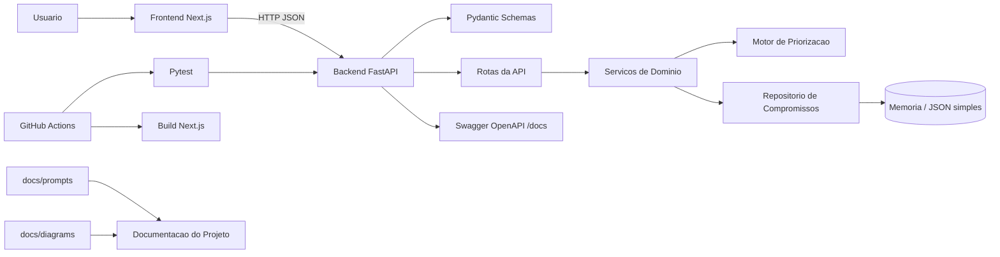
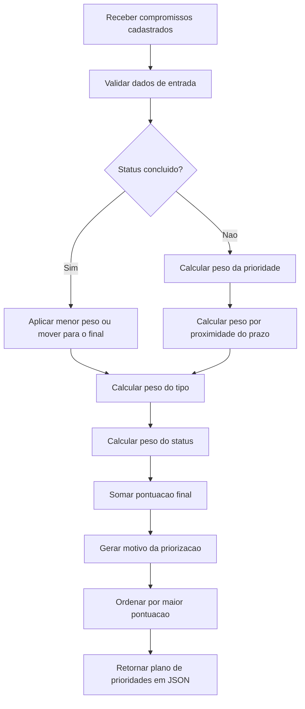

# Arquitetura do AgendaEdu

Issue de referencia: `#13 Planejar arquitetura com suporte de IA`

Branch indicada: `feature/especificacao-arquitetura`

Prompt relacionado: `docs/prompts/03-arquitetura-diagramas.md`

## 1. Decisoes arquiteturais

- A aplicacao sera dividida em frontend Next.js e backend FastAPI.
- O frontend sera responsavel apenas por interacao com usuario, exibicao de dados e chamadas HTTP para a API.
- O backend concentrara validacoes, regras de negocio, filtros e calculo do plano de prioridades.
- A comunicacao entre frontend e backend sera feita por API JSON.
- O armazenamento inicial sera em memoria, com possibilidade de evoluir para arquivo JSON simples sem alterar a interface da API.
- A documentacao tecnica usara README, arquivos em `docs/`, prompts rastreaveis em `docs/prompts/` e diagramas Mermaid em `docs/diagrams/`.
- A suite inicial de testes ficara concentrada no backend, cobrindo validacoes, filtros e regra de priorizacao.
- O pipeline CI/CD devera executar lint do backend, testes Pytest e build do frontend.

Justificativas curtas:

- Next.js reduz o custo de setup e entrega uma interface demonstravel rapidamente.
- FastAPI oferece validacao com Pydantic, documentacao OpenAPI automatica e testes simples com Pytest.
- Regra de negocio no backend evita duplicacao de logica entre frontend e API.
- Armazenamento simples atende ao escopo avaliativo sem introduzir complexidade de banco de dados antes da necessidade.

## 2. Responsabilidades por camada

### Frontend Next.js

- Renderizar formulario de cadastro de compromissos.
- Renderizar listagem e filtros.
- Renderizar plano de prioridades.
- Chamar endpoints da API.
- Exibir mensagens de erro retornadas pelo backend.
- Manter estados de tela, carregamento e erro.

### Backend FastAPI

- Expor endpoints JSON.
- Validar payloads com Pydantic.
- Criar compromissos.
- Listar compromissos.
- Filtrar compromissos por disciplina, tipo, prioridade e status.
- Calcular pontuacao de prioridade.
- Retornar plano de prioridades ordenado.
- Expor documentacao OpenAPI em `/docs`.

### Servicos de dominio

- Centralizar a regra de priorizacao.
- Calcular pesos por prioridade, prazo, tipo e status.
- Gerar motivos legiveis para cada item priorizado.

### Repositorio de dados

- Manter compromissos em memoria no ciclo inicial.
- Isolar acesso aos dados para permitir troca futura por arquivo JSON ou banco.

### Testes

- Validar endpoint de saude.
- Validar cadastro.
- Validar campos obrigatorios.
- Validar enums de tipo, prioridade e status.
- Validar filtros.
- Validar ordenacao do plano de prioridades.

### CI/CD

- Instalar dependencias do backend.
- Executar lint do backend.
- Executar testes Pytest.
- Instalar dependencias do frontend.
- Executar build do frontend.

## 3. Diagrama Mermaid de arquitetura

Arquivo: `docs/diagrams/arquitetura-agendaedu.mmd`

## 4. Diagrama Mermaid do fluxo de priorizacao

Arquivo: `docs/diagrams/fluxo-priorizacao.mmd`

## 5. Riscos e mitigacoes

| Risco | Impacto | Mitigacao |
| --- | --- | --- |
| Regra de prioridade subjetiva | Ordenacao pode parecer arbitraria | Documentar pesos e cobrir cenarios com testes |
| Armazenamento em memoria perde dados ao reiniciar | Demonstracao pode perder registros | Usar massa de exemplo e planejar JSON simples como evolucao |
| Frontend duplicar regra de negocio | Divergencia entre tela e API | Concentrar calculo no backend e usar frontend apenas para exibicao |
| Falta de testes de frontend no primeiro ciclo | Menor cobertura da interface | Registrar como melhoria futura e priorizar testes de backend |
| Scripts locais divergirem entre Windows e Linux | Dificuldade de demonstracao | Manter `scripts/dev.ps1` e `scripts/dev.sh` documentados |
| Prompts ficarem desatualizados | Perda de rastreabilidade da IA | Atualizar `docs/prompts/` a cada etapa guiada por IA |

## 6. Proximos passos

- Implementar endpoints principais do backend.
- Definir pesos numericos da regra de priorizacao.
- Criar testes Pytest para a regra de dominio.
- Integrar frontend com a API.
- Atualizar README com diagrama e instrucoes finais.

